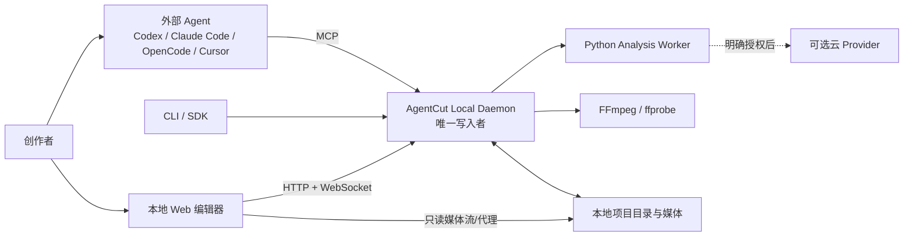
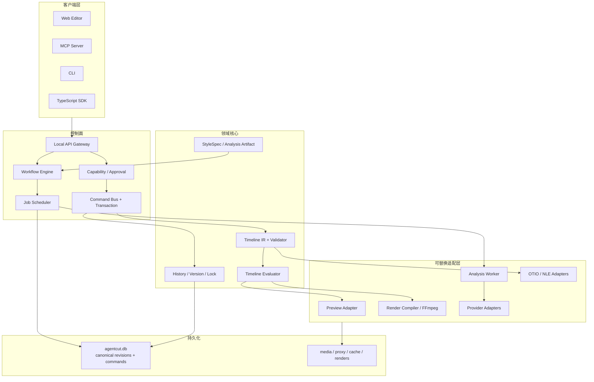
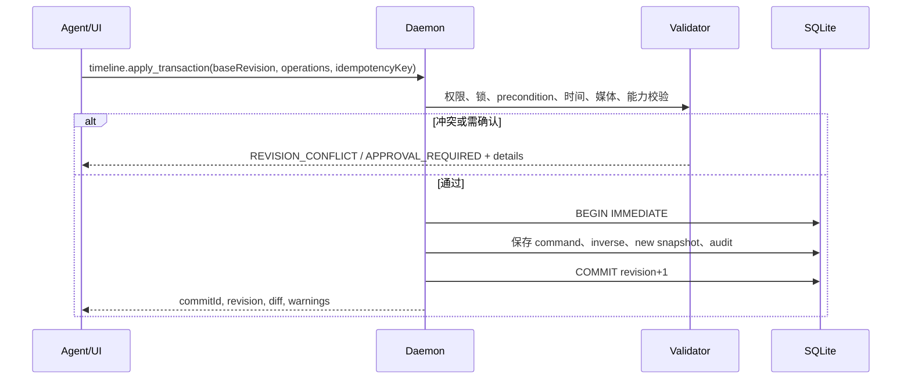
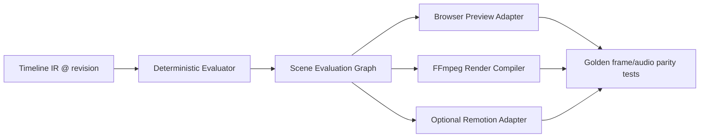

# AgentCut 总体架构

## 1. 推荐方案

采用 **pnpm monorepo + TypeScript 主控制面 + Python 分析 worker + FFmpeg 媒体/最终渲染 + 浏览器预览适配器**。

- TypeScript：Timeline schema/engine、command bus、MCP/CLI/SDK、本地服务和 Web 编辑器共享类型与验证逻辑。
- Python：ASR、VAD、diarization、CV/ML 生态；通过版本化 job protocol 隔离，不能直接写 Timeline。
- FFmpeg/ffprobe：受控 binary；由 Render Compiler 调用。
- Rust：V0.1 不引入。只有 browser/FFmpeg 无法满足已测性能、或 Tauri 桌面化需要原生服务时再增加。
- Monorepo：适合，因为 schema、command、protocol、fixtures 必须原子升级；模型权重和媒体项目不进入仓库。

明确不选：

- 全 Python：难以与 Web 时间线共享精确类型和交互逻辑。
- 全 Rust：首发会把精力放在 binding/codec/桌面工程，而不是验证中文剪辑和协议。
- Remotion/OTIO/第三方编辑器模型作为核心：都会让产品语义受外部模型限制。

## 2. 系统上下文



所有修改都进入 Local Daemon。Web 编辑器不能把 React/Zustand 状态直接落盘；Agent 不能直接写 JSON、SQLite 或执行 FFmpeg。

## 3. 逻辑分层



## 4. 推荐仓库结构

```text
AgentCut/
├── apps/
│   ├── web-editor/            # React + Vite；只持有视图缓存
│   ├── local-daemon/          # Fastify/HTTP/WS、single writer、jobs
│   ├── mcp-server/            # stdio/streamable HTTP adapter
│   └── cli/                   # agentcut 命令
├── packages/
│   ├── timeline-schema/       # JSON Schema、generated TS、migrations
│   ├── timeline-engine/       # 纯函数、时间映射、约束、diff
│   ├── edit-commands/         # command validator/inverse/transaction
│   ├── agent-protocol/        # request/result/error/capability
│   ├── local-sdk/             # CLI/MCP/Web 共用 client
│   ├── project-store/         # SQLite repository + snapshot/event log
│   ├── media-engine/          # probe/proxy/waveform/thumbnail
│   ├── preview-engine/        # browser adapter + capability report
│   ├── render-engine/         # evaluation graph + FFmpeg compiler
│   ├── workflow-engine/       # resumable stage machine
│   ├── provider-sdk/          # provider manifest/cost/privacy
│   ├── otio-adapter/          # import/export/loss report
│   └── test-fixtures/         # media + golden timelines + frames
├── services/
│   └── analysis-python/       # ASR/VAD/scene/diarization adapters
├── workflows/
│   ├── talking-head/
│   └── interview-clips/
├── docs/
└── tools/                     # dev scripts; 不含产品业务真相
```

使用 `pnpm workspaces`；构建缓存可用 Turborepo，但包依赖图不能依赖 Turborepo 运行时。Python 服务用 `uv` 管理，协议 fixture 由 JSON Schema 双向验证。

## 5. 核心不变量

1. 每个 Timeline 变更对应一个已验证、已提交的 transaction。
2. 每个 transaction 有 `baseRevision`；旧 revision 不能静默覆盖。
3. 用户锁优先级高于 Agent 权限；绕过锁需要新 approval。
4. AnalysisArtifact 不自动改变 Timeline；只有 command 才改变。
5. 缓存、代理、缩略图、preview render 可删除重建，不属于 truth。
6. 渲染命令是 IR 的派生物，不持久化为项目语义。
7. Provider 原始响应保存在 artifact provenance，不泄漏到稳定 IR。
8. UI 本地 optimistic state 必须收到 daemon commit 才算成功。

## 6. 数据流与控制流

### 6.1 素材分析

```mermaid
sequenceDiagram
  participant UI as Web/Agent
  participant D as Local Daemon
  participant J as Job Scheduler
  participant W as Analysis Worker
  participant S as Project Store

  UI->>D: analysis.start(assetId, kind, options)
  D->>S: 写 Job(pending) 与 cost estimate
  D-->>UI: jobId + requiresApproval?
  D->>J: enqueue
  J->>W: immutable asset descriptor + options
  W-->>J: progress + versioned artifact
  J->>S: atomic save artifact; Job=succeeded
  D-->>UI: WebSocket job.completed
  UI->>D: workflow.propose(artifactIds)
  D-->>UI: proposal，不修改 Timeline
```

### 6.2 时间线事务



### 6.3 自动工作流

Workflow Engine 只编排 stage 状态和 artifacts，不直接突变 Timeline：

`ingest -> transcribe -> analyze -> propose -> approve -> apply -> decorate -> preview -> quality_check -> version -> export`

每个 stage：

- 输入 artifact IDs 与配置哈希。
- 输出 versioned artifact 或 transaction proposal。
- 可 `pending/running/waiting_approval/succeeded/failed/cancelled`。
- 相同输入哈希命中缓存；Provider/model/version 改变则不命中。
- 失败可从最近 succeeded stage 恢复。

## 7. Timeline Core

### 7.1 领域划分

- `Project`：项目设置、资产索引、sequence IDs、active version。
- `Asset`：不可变源媒体身份与 stream metadata；proxy 是 derivative。
- `Sequence`：画布、frame rate、tracks、markers、locks、export defaults。
- `Clip`：源引用、timeline range、source range、transform、effects、metadata。
- `Transcript`：分析产物，保留词级 evidence；不等同于 caption。
- `CaptionTrack`：展示语义与样式；可由 transcript 派生后人工修改。
- `StyleSpec`：描述性统计和约束，不含可执行代码。
- `EditCommand`：唯一 mutation 入口。

### 7.2 时间模型

不用浮点秒作为 canonical time。使用整数 `value` + 有理 `rate(numerator/denominator)`：

- sequence 位置通常以 frame rate 表达，例如 `value=300, rate=30000/1001`。
- ASR 词边界可用 `rate=1000/1` 的毫秒单位。
- source stream 使用 ffprobe time base；VFR 资产保留 PTS map。
- evaluator 使用有理数比较/换算；仅 UI 格式化为秒。

### 7.3 OTIO 策略

内部 IR 不 subclass OTIO。adapter 映射：

| AgentCut | OTIO | 说明 |
|---|---|---|
| Sequence/Track/Clip/Gap | Timeline/Track/Clip/Gap | 可直接映射 |
| sourceRange | TimeRange | 可直接映射 |
| Transition/basic speed | Transition/TimeEffect | 支持子集 |
| Asset | MediaReference | 路径需相对化/重链接 |
| Caption/Graphic | Marker/metadata 或渲染资产 | 第三方有损 |
| Transcript/StyleSpec/Agent audit/locks | metadata + sidecar | 不承诺第三方保留 |

导出生成 `interchange-report.json`，列出 `preserved/degraded/dropped/baked`。DaVinci 可优先 OTIO；Premiere/FCP 还需 FCP XML/FCPXML 专用 adapter 和版本实测。

## 8. 持久化、版本与撤销

### 8.1 项目目录

```text
my-video/
├── agentcut.project.json       # 可读入口：项目 ID、schema、daemon hint
├── .agentcut/
│   ├── agentcut.db             # canonical snapshot/commands/jobs/versions
│   ├── lock.json               # 进程 lease 信息
│   ├── logs/audit.ndjson       # 可导出审计镜像，非 canonical
│   └── cache/                  # 可删
├── media/                      # 用户素材，可配置原位引用
├── proxies/
├── artifacts/
└── renders/
```

`agentcut.db` 是唯一持久化真相；`agentcut.project.json` 不是 Timeline 副本。显式版本可导出为可读 JSON bundle，用于备份和 Git diff，但重新导入必须经 migration/validation。

### 8.2 版本机制

- 每次事务：递增 revision，记录 command、inverse、before/after hash。
- undo/redo：提交新 transaction，永不删除历史。
- `version.create`：为 revision 命名并固定 snapshot/artifact refs。
- `version.restore`：创建一个恢复 transaction/branch，不重写历史。
- 定期 snapshot + event tail；启动时验证 hash chain，必要时截断未提交 WAL。

## 9. 并发和锁

三种锁不能混淆：

1. **项目进程锁**：OS file lock + lease，保证一个 daemon 是写入者；第二个进程进入只读或连接已有 daemon。
2. **乐观并发**：所有写请求带 `baseRevision`；返回最小 changed object IDs 和 rebase hint。
3. **语义用户锁**：IR 中的 `LockRegion` 可锁 sequence range、clip、track 或 property；默认 Agent 不可覆盖。

长任务不持有 DB 事务。分析基于 asset/artifact hash；应用结果时重新检查 revision 和 preconditions。

## 10. Web 编辑器架构

### 10.1 状态边界

- Server state：Timeline snapshot、revision、jobs、versions，通过 query cache 管理。
- Ephemeral UI state：selection、panel layout、hover、drag preview、playhead。
- Drag 时可本地预览；drop 后提交 command；失败则回滚视图并展示原因。
- Transcript selection 使用 word IDs，不使用不稳定的字符 offset。

### 10.2 时间线

V0.1 自持 timeline interaction model；可使用 Canvas/WebGL 做绘制，但业务 mutation 只产生 commands。虚拟化只渲染可见 track/time range，波形与 filmstrip 是 cache tiles。

### 10.3 浏览器预览

- `timeline-engine` 将 IR 在时间 `t` 评估为 renderer-neutral `SceneEvaluationGraph`。
- 首选：Mediabunny/WebCodecs + Canvas2D/WebGL；codec 不支持则使用 FFmpeg proxy。
- Audio 使用 Web Audio graph，主时钟由统一 playback controller 管理。
- 不以第三方 composition/store 作为 truth；OpenReel/Diffusion/OpenVideo 若采用，只实现 PreviewAdapter。

## 11. 预览与最终渲染一致性



一致性策略：

- V0.1 只发布 parity 子集：trim/split/move、crop/scale/position/opacity、音量/淡入淡出、基础文字/字幕、crossfade。
- 每个效果声明 `previewSupport` 与 `exportSupport`：`exact/approximate/unsupported`。
- 字体随项目固定并记录 hash；统一 safe area、pixel aspect、rotation、color metadata。
- 代理只改变解码源，不改变 source/timeline time mapping。
- 建立 golden fixtures：CFR/VFR、29.97、旋转手机、长 GOP、多音轨、中文字体、HDR-to-SDR。
- CI 对关键帧做像素/感知差异，对音频做 onset/响度/时长差异；超阈值阻断发布。
- approximation 必须在预览和 export preflight 中可见，不能静默降级。

Remotion 输出两种方式：

1. 可映射的基础 animation 编译自 IR primitives。
2. 复杂 composition 先渲染成带 alpha 的 media asset，再插入 Timeline；源代码/参数作为 provenance，不成为 IR 类型。

## 12. Provider 系统

每个 Provider 实现 manifest：

```text
id, version, capabilities, locality, supportedLanguages,
inputLimits, outputSchemaVersion, pricingModel,
privacyPolicyUrl, requiresNetwork, requiresCredential,
supportsCancellation, deterministic, healthCheck
```

调用前生成 `ProviderPlan`：

- 将上传哪些数据、到哪个 provider。
- 预计单位、价格区间和硬预算。
- 本地替代与质量/速度差异。
- 缓存键与数据保留策略。

Provider 响应先归一为 `AnalysisArtifact`；任何模型字段变化只改 adapter。素材补充策略是项目级 policy：local_only / stock / generated / mixed，默认 `local_only`。

## 13. Windows/macOS 兼容

- Node/Python/FFmpeg 版本通过 doctor 检查；路径全部使用 file URL/跨平台 path abstraction。
- 不在业务逻辑依赖 bash、symlink、`/tmp`、Unix signals 或 shell quoting。
- FFmpeg 用 argv 数组启动，不拼接 shell 字符串。
- 长路径、中文/emoji 文件名、盘符/UNC、权限拒绝、外接盘断开纳入测试。
- 硬件编码按运行时探测：VideoToolbox、NVENC、QSV、AMF；失败自动回退软件编码并提示成本。
- 本地模型安装按 optional capability，不阻断纯云或只编辑已有 transcript 的流程。

## 14. 错误恢复

| 失败点 | 恢复策略 |
|---|---|
| command 校验失败 | 不写 DB；返回字段级错误 |
| 事务中进程崩溃 | SQLite WAL 回滚；revision 不增加 |
| 分析 worker 崩溃 | Job failed/retryable；保留已完成 artifacts |
| Provider 超时/扣费不明 | 标记 `outcome_unknown`，禁止自动重试付费任务 |
| proxy/render 中断 | 临时文件带 job ID；重启清理或续跑，绝不覆盖成功文件 |
| 媒体移动/丢失 | Asset offline；timeline 保留；支持 relink + hash 验证 |
| Web 断连 | 重连后以 daemon revision 为准，丢弃未提交 optimistic state |
| schema 升级失败 | 复制 DB、dry-run migration、校验后原子切换 |

## 15. 安全边界

- Daemon 只绑定 `127.0.0.1`/`::1`，随机端口，启动 token，严格 Origin/CSRF。
- MCP session 绑定 project root 和 capabilities；默认不能遍历项目外路径。
- 导入项目外文件需要显式 import/relink，记录真实路径但 API 默认只返回 asset ID。
- transcript、reference 视频字幕、文件名和 metadata 全是**不可信输入**，不能被当作 Agent 指令。
- Analysis worker 无 Timeline 写权限；Render worker 无 Provider credential 读取权。
- credential 存 OS keychain/环境变量，日志只记 credential ID。
- 任意网络上传、付费调用、AI 生成和覆盖锁都走 approval policy。
- FFmpeg 参数由 typed compiler + allowlist 生成；禁止 MCP 暴露 raw command。
- 审计日志可导出但默认脱敏路径、Token 和 Provider 响应中的个人信息。

## 16. 关键 ADR

| ADR | 选择 | 原因 | 重新评估条件 |
|---|---|---|---|
| A-001 | 自有 IR + OTIO adapter | Agent 语义远超 OTIO，仍需 NLE 交换 | OTIO 原生覆盖字幕/审计/锁且生态保留扩展 |
| A-002 | TypeScript control plane + Python worker | Web/协议一致与 ML 生态兼顾 | Python IPC 成为主要性能瓶颈 |
| A-003 | FFmpeg final render | 稳定、跨平台、能力广 | filtergraph 无法维护或效果需求要求 MLT/原生 compositor |
| A-004 | 浏览器 adapter 自持边界 | 第三方引擎许可/成熟度不确定 | 某引擎通过许可、parity、性能和迁移 spike |
| A-005 | SQLite 单写者 | 原子事务、恢复、查询和本地部署 | 多人云协作成为主场景 |
| A-006 | Rust 后置 | 先验证产品核心 | 性能 profiling 或桌面权限/codec 证明必要 |
| A-007 | Remotion 可选 | 动态视觉价值高但许可/绑定风险 | 获得稳定商业条款且仍保持替代 renderer |
