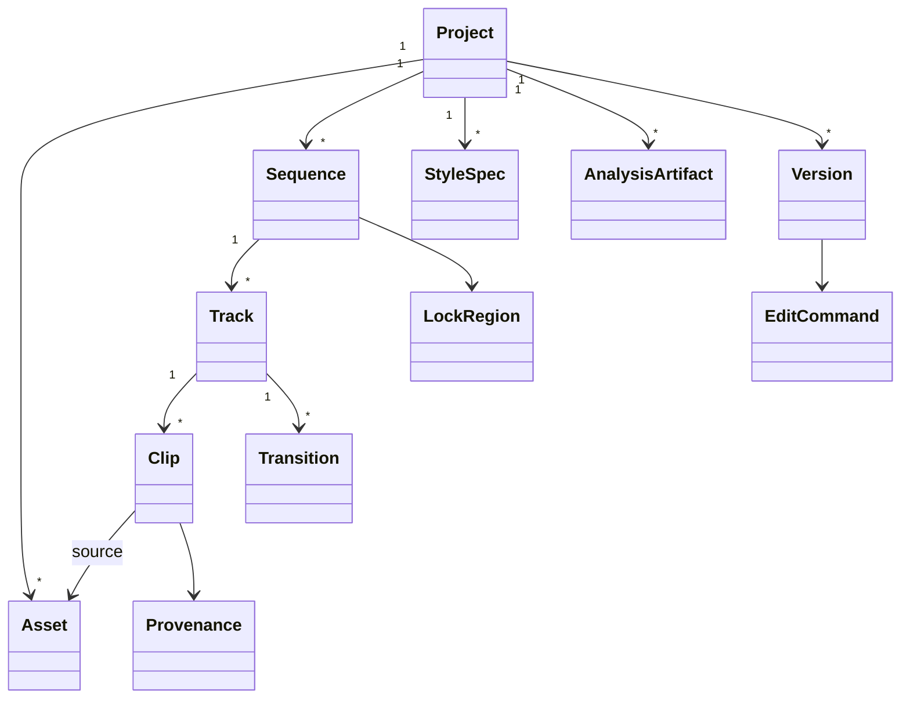

# Timeline IR 草案

> 状态：Draft 0.1，用于技术验证和协议评审，不是已冻结实现。`schemaVersion` 与 command protocol 分别版本化。

## 1. 设计目标

- UI、Agent、CLI、预览和渲染共享同一领域模型。
- 时间、源区间和帧率可精确表达 CFR/VFR、29.97 和词级时间戳。
- 每个自动修改可解释、可撤销、可审计。
- Transcript、Caption、StyleSpec 和 Timeline 各自独立但可追踪来源。
- 未知扩展可保留；不允许未知字段悄悄影响渲染。
- 可适配 OTIO，但不受 OTIO 限制。

## 2. 不变量

1. `id` 在项目内稳定，删除后不复用。
2. `Time.value` 是安全整数；`seconds = value * rate.denominator / rate.numerator`。
3. Clip 的 `timelineRange.duration`、`sourceRange.duration` 与 speed map 必须可推导一致。
4. Asset 原始媒体不可变；proxy/thumbnail/waveform 是 derivative。
5. AnalysisArtifact 不嵌入 Timeline 大对象，只通过 ID/provenance 引用。
6. Caption 的文字可人工修改，不反写 Transcript；需要同步时产生显式 command。
7. 用户锁由 daemon 强制验证，renderer 只读取其结果。
8. `confidence` 只描述特定 assertion，不能作为全对象“可信度”。

## 3. 顶层模型



## 4. JSON Schema 草案

下面是可独立验证的核心 schema。为控制篇幅，Provider artifact 的具体 payload 通过 `artifactType + payload` 另行版本化；核心禁止根据未知 payload 改变渲染。

```json
{
  "$schema": "https://json-schema.org/draft/2020-12/schema",
  "$id": "https://agentcut.local/schemas/timeline-project-0.1.schema.json",
  "title": "AgentCut Project",
  "type": "object",
  "additionalProperties": false,
  "required": ["schemaVersion", "project", "assets", "sequences", "styleSpecs", "artifacts", "exportPresets", "versions", "history"],
  "properties": {
    "schemaVersion": { "const": "0.1.0" },
    "project": { "$ref": "#/$defs/project" },
    "assets": { "type": "array", "items": { "$ref": "#/$defs/asset" } },
    "sequences": { "type": "array", "items": { "$ref": "#/$defs/sequence" } },
    "styleSpecs": { "type": "array", "items": { "$ref": "#/$defs/styleSpec" } },
    "artifacts": { "type": "array", "items": { "$ref": "#/$defs/artifactRef" } },
    "exportPresets": { "type": "array", "items": { "$ref": "#/$defs/exportPreset" } },
    "versions": { "type": "array", "items": { "$ref": "#/$defs/versionRecord" } },
    "history": { "$ref": "#/$defs/historyIndex" },
    "extensions": { "type": "object", "additionalProperties": true }
  },
  "$defs": {
    "id": { "type": "string", "pattern": "^[a-z][a-z0-9_-]{2,127}$" },
    "rate": {
      "type": "object",
      "additionalProperties": false,
      "required": ["numerator", "denominator"],
      "properties": {
        "numerator": { "type": "integer", "minimum": 1 },
        "denominator": { "type": "integer", "minimum": 1 }
      }
    },
    "time": {
      "type": "object",
      "additionalProperties": false,
      "required": ["value", "rate"],
      "properties": {
        "value": { "type": "integer", "minimum": 0, "maximum": 9007199254740991 },
        "rate": { "$ref": "#/$defs/rate" }
      }
    },
    "timeRange": {
      "type": "object",
      "additionalProperties": false,
      "required": ["start", "duration"],
      "properties": {
        "start": { "$ref": "#/$defs/time" },
        "duration": { "$ref": "#/$defs/time" }
      }
    },
    "assertion": {
      "type": "object",
      "additionalProperties": false,
      "required": ["kind", "confidence", "evidenceRefs"],
      "properties": {
        "kind": { "type": "string" },
        "confidence": { "type": "number", "minimum": 0, "maximum": 1 },
        "evidenceRefs": { "type": "array", "items": { "type": "string" } },
        "model": { "type": "string" },
        "explanationZh": { "type": "string" }
      }
    },
    "provenance": {
      "type": "object",
      "additionalProperties": false,
      "required": ["createdBy", "createdAt", "reason"],
      "properties": {
        "createdBy": {
          "type": "object",
          "additionalProperties": false,
          "required": ["kind", "id"],
          "properties": {
            "kind": { "enum": ["user", "agent", "workflow", "import", "migration"] },
            "id": { "type": "string" },
            "displayName": { "type": "string" }
          }
        },
        "createdAt": { "type": "string", "format": "date-time" },
        "reason": { "type": "string", "minLength": 1 },
        "assertions": { "type": "array", "items": { "$ref": "#/$defs/assertion" } },
        "sourceCommandId": { "type": "string" },
        "sourceArtifactIds": { "type": "array", "items": { "type": "string" } }
      }
    },
    "project": {
      "type": "object",
      "additionalProperties": false,
      "required": ["id", "name", "createdAt", "updatedAt", "activeSequenceId", "revision"],
      "properties": {
        "id": { "$ref": "#/$defs/id" },
        "name": { "type": "string", "minLength": 1 },
        "createdAt": { "type": "string", "format": "date-time" },
        "updatedAt": { "type": "string", "format": "date-time" },
        "activeSequenceId": { "$ref": "#/$defs/id" },
        "revision": { "type": "integer", "minimum": 0 },
        "defaultStyleSpecId": { "$ref": "#/$defs/id" },
        "metadata": { "type": "object", "additionalProperties": true }
      }
    },
    "asset": {
      "type": "object",
      "additionalProperties": false,
      "required": ["id", "kind", "uri", "contentHash", "availability", "streams", "provenance"],
      "properties": {
        "id": { "$ref": "#/$defs/id" },
        "kind": { "enum": ["video", "audio", "image", "sticker", "font", "generated", "reference"] },
        "uri": { "type": "string" },
        "contentHash": { "type": "string", "pattern": "^sha256:[a-f0-9]{64}$" },
        "availability": { "enum": ["online", "offline", "pending", "failed"] },
        "streams": {
          "type": "array",
          "items": {
            "type": "object",
            "additionalProperties": false,
            "required": ["index", "kind", "codec", "timeBase"],
            "properties": {
              "index": { "type": "integer", "minimum": 0 },
              "kind": { "enum": ["video", "audio", "subtitle", "data"] },
              "codec": { "type": "string" },
              "timeBase": { "$ref": "#/$defs/rate" },
              "duration": { "$ref": "#/$defs/time" },
              "width": { "type": "integer", "minimum": 1 },
              "height": { "type": "integer", "minimum": 1 },
              "frameRate": { "$ref": "#/$defs/rate" },
              "variableFrameRate": { "type": "boolean" },
              "sampleRate": { "type": "integer", "minimum": 1 },
              "channels": { "type": "integer", "minimum": 1 },
              "rotationDegrees": { "type": "integer" },
              "color": { "type": "object", "additionalProperties": true }
            }
          }
        },
        "derivatives": {
          "type": "array",
          "items": {
            "type": "object",
            "required": ["kind", "uri", "contentHash"],
            "properties": {
              "kind": { "enum": ["proxy", "thumbnail", "filmstrip", "waveform", "audio_extract", "frame_index"] },
              "uri": { "type": "string" },
              "contentHash": { "type": "string" }
            },
            "additionalProperties": false
          }
        },
        "provenance": { "$ref": "#/$defs/provenance" },
        "metadata": { "type": "object", "additionalProperties": true }
      }
    },
    "sequence": {
      "type": "object",
      "additionalProperties": false,
      "required": ["id", "name", "canvas", "frameRate", "tracks", "locks", "markers"],
      "properties": {
        "id": { "$ref": "#/$defs/id" },
        "name": { "type": "string" },
        "canvas": {
          "type": "object",
          "additionalProperties": false,
          "required": ["width", "height", "background"],
          "properties": {
            "width": { "type": "integer", "minimum": 1 },
            "height": { "type": "integer", "minimum": 1 },
            "background": { "type": "string" },
            "pixelAspect": { "$ref": "#/$defs/rate" }
          }
        },
        "frameRate": { "$ref": "#/$defs/rate" },
        "tracks": { "type": "array", "items": { "$ref": "#/$defs/track" } },
        "locks": { "type": "array", "items": { "$ref": "#/$defs/lockRegion" } },
        "markers": { "type": "array", "items": { "$ref": "#/$defs/marker" } },
        "styleSpecId": { "$ref": "#/$defs/id" },
        "exportPresetId": { "$ref": "#/$defs/id" }
      }
    },
    "track": {
      "type": "object",
      "additionalProperties": false,
      "required": ["id", "kind", "name", "order", "locked", "enabled", "clips", "transitions"],
      "properties": {
        "id": { "$ref": "#/$defs/id" },
        "kind": { "enum": ["video", "audio", "caption", "graphic"] },
        "name": { "type": "string" },
        "order": { "type": "integer" },
        "locked": { "type": "boolean" },
        "enabled": { "type": "boolean" },
        "muted": { "type": "boolean" },
        "clips": { "type": "array", "items": { "$ref": "#/$defs/clip" } },
        "transitions": { "type": "array", "items": { "$ref": "#/$defs/transition" } },
        "metadata": { "type": "object", "additionalProperties": true }
      }
    },
    "clip": {
      "type": "object",
      "additionalProperties": false,
      "required": ["id", "kind", "timelineRange", "enabled", "provenance"],
      "properties": {
        "id": { "$ref": "#/$defs/id" },
        "kind": { "enum": ["media", "caption", "text", "image", "sticker", "shape", "nestedSequence", "gap"] },
        "assetId": { "$ref": "#/$defs/id" },
        "sequenceId": { "$ref": "#/$defs/id" },
        "streamIndex": { "type": "integer", "minimum": 0 },
        "timelineRange": { "$ref": "#/$defs/timeRange" },
        "sourceRange": { "$ref": "#/$defs/timeRange" },
        "enabled": { "type": "boolean" },
        "transform": { "$ref": "#/$defs/transform" },
        "audio": { "$ref": "#/$defs/audio" },
        "content": { "$ref": "#/$defs/content" },
        "animations": { "type": "array", "items": { "$ref": "#/$defs/animation" } },
        "effects": { "type": "array", "items": { "$ref": "#/$defs/effect" } },
        "provenance": { "$ref": "#/$defs/provenance" },
        "metadata": { "type": "object", "additionalProperties": true }
      },
      "allOf": [
        {
          "if": { "properties": { "kind": { "enum": ["media", "image", "sticker"] } } },
          "then": { "required": ["assetId", "sourceRange"] }
        },
        {
          "if": { "properties": { "kind": { "enum": ["caption", "text", "shape"] } } },
          "then": { "required": ["content"] }
        }
      ]
    },
    "transform": {
      "type": "object",
      "additionalProperties": false,
      "required": ["position", "scale", "rotationDegrees", "anchor", "opacity", "fit"],
      "properties": {
        "position": { "$ref": "#/$defs/point" },
        "scale": { "$ref": "#/$defs/point" },
        "rotationDegrees": { "type": "number" },
        "anchor": { "$ref": "#/$defs/point" },
        "opacity": { "type": "number", "minimum": 0, "maximum": 1 },
        "fit": { "enum": ["contain", "cover", "stretch", "none"] },
        "crop": {
          "type": "object",
          "additionalProperties": false,
          "required": ["x", "y", "width", "height", "unit"],
          "properties": {
            "x": { "type": "number" }, "y": { "type": "number" },
            "width": { "type": "number", "exclusiveMinimum": 0 },
            "height": { "type": "number", "exclusiveMinimum": 0 },
            "unit": { "enum": ["normalized", "pixels"] }
          }
        }
      }
    },
    "point": {
      "type": "object",
      "additionalProperties": false,
      "required": ["x", "y"],
      "properties": { "x": { "type": "number" }, "y": { "type": "number" } }
    },
    "audio": {
      "type": "object",
      "additionalProperties": false,
      "properties": {
        "gainDb": { "type": "number", "minimum": -96, "maximum": 24 },
        "pan": { "type": "number", "minimum": -1, "maximum": 1 },
        "fadeIn": { "$ref": "#/$defs/time" },
        "fadeOut": { "$ref": "#/$defs/time" },
        "role": { "enum": ["dialogue", "music", "sfx", "ambience", "other"] }
      }
    },
    "content": {
      "type": "object",
      "additionalProperties": false,
      "properties": {
        "text": { "type": "string" },
        "style": { "type": "object", "additionalProperties": true },
        "wordTimings": { "type": "array", "items": { "$ref": "#/$defs/wordTiming" } },
        "transcriptSegmentIds": { "type": "array", "items": { "type": "string" } },
        "shape": { "type": "object", "additionalProperties": true }
      }
    },
    "wordTiming": {
      "type": "object",
      "additionalProperties": false,
      "required": ["id", "text", "range"],
      "properties": {
        "id": { "$ref": "#/$defs/id" },
        "text": { "type": "string" },
        "range": { "$ref": "#/$defs/timeRange" },
        "transcriptWordId": { "type": "string" },
        "highlight": { "type": "boolean" },
        "confidence": { "type": "number", "minimum": 0, "maximum": 1 }
      }
    },
    "animation": {
      "type": "object",
      "additionalProperties": false,
      "required": ["id", "property", "keyframes"],
      "properties": {
        "id": { "$ref": "#/$defs/id" },
        "property": { "enum": ["position.x", "position.y", "scale.x", "scale.y", "rotationDegrees", "opacity", "audio.gainDb"] },
        "keyframes": {
          "type": "array", "minItems": 1,
          "items": {
            "type": "object",
            "additionalProperties": false,
            "required": ["at", "value", "easing"],
            "properties": {
              "at": { "$ref": "#/$defs/time" },
              "value": {},
              "easing": { "enum": ["linear", "easeIn", "easeOut", "easeInOut", "step"] }
            }
          }
        }
      }
    },
    "effect": {
      "type": "object",
      "additionalProperties": false,
      "required": ["id", "type", "enabled", "params"],
      "properties": {
        "id": { "$ref": "#/$defs/id" },
        "type": { "enum": ["blur", "brightness", "contrast", "saturation", "audioDenoise", "loudnessNormalize"] },
        "enabled": { "type": "boolean" },
        "params": { "type": "object", "additionalProperties": true }
      }
    },
    "transition": {
      "type": "object",
      "additionalProperties": false,
      "required": ["id", "fromClipId", "toClipId", "type", "duration"],
      "properties": {
        "id": { "$ref": "#/$defs/id" },
        "fromClipId": { "$ref": "#/$defs/id" },
        "toClipId": { "$ref": "#/$defs/id" },
        "type": { "enum": ["cut", "crossfade", "dipToBlack", "slide"] },
        "duration": { "$ref": "#/$defs/time" },
        "params": { "type": "object", "additionalProperties": true }
      }
    },
    "lockRegion": {
      "type": "object",
      "additionalProperties": false,
      "required": ["id", "owner", "mode", "scope", "createdAt"],
      "properties": {
        "id": { "$ref": "#/$defs/id" },
        "owner": { "type": "string" },
        "mode": { "enum": ["deny_agent", "deny_all_except_owner"] },
        "scope": {
          "oneOf": [
            { "type": "object", "required": ["kind", "range"], "properties": { "kind": { "const": "range" }, "range": { "$ref": "#/$defs/timeRange" } }, "additionalProperties": false },
            { "type": "object", "required": ["kind", "objectId"], "properties": { "kind": { "enum": ["clip", "track"] }, "objectId": { "$ref": "#/$defs/id" } }, "additionalProperties": false },
            { "type": "object", "required": ["kind", "objectId", "property"], "properties": { "kind": { "const": "property" }, "objectId": { "$ref": "#/$defs/id" }, "property": { "type": "string" } }, "additionalProperties": false }
          ]
        },
        "createdAt": { "type": "string", "format": "date-time" },
        "note": { "type": "string" }
      }
    },
    "marker": {
      "type": "object",
      "additionalProperties": false,
      "required": ["id", "at", "kind", "label"],
      "properties": {
        "id": { "$ref": "#/$defs/id" },
        "at": { "$ref": "#/$defs/time" },
        "kind": { "enum": ["chapter", "beat", "comment", "hook", "quality_issue"] },
        "label": { "type": "string" },
        "metadata": { "type": "object", "additionalProperties": true }
      }
    },
    "styleSpec": {
      "type": "object",
      "additionalProperties": false,
      "required": ["id", "version", "name", "provenance", "observations", "rules"],
      "properties": {
        "id": { "$ref": "#/$defs/id" },
        "version": { "type": "string" },
        "name": { "type": "string" },
        "provenance": { "$ref": "#/$defs/provenance" },
        "observations": { "type": "object", "additionalProperties": true },
        "rules": {
          "type": "array",
          "items": {
            "type": "object",
            "additionalProperties": false,
            "required": ["id", "dimension", "strength", "constraint", "assertion"],
            "properties": {
              "id": { "$ref": "#/$defs/id" },
              "dimension": { "enum": ["hook", "pacing", "shotLength", "caption", "highlight", "graphic", "zoom", "broll", "transition", "music", "density", "emotion", "composition"] },
              "strength": { "enum": ["hint", "prefer", "require"] },
              "constraint": { "type": "object", "additionalProperties": true },
              "assertion": { "$ref": "#/$defs/assertion" }
            }
          }
        },
        "copyrightNote": { "type": "string" }
      }
    },
    "artifactRef": {
      "type": "object",
      "additionalProperties": false,
      "required": ["id", "artifactType", "schemaVersion", "contentHash", "uri", "createdAt"],
      "properties": {
        "id": { "$ref": "#/$defs/id" },
        "artifactType": { "enum": ["transcript", "sceneAnalysis", "styleAnalysis", "editCandidates", "speakerDiarization", "topicSegments", "qualityReport", "renderReport"] },
        "schemaVersion": { "type": "string" },
        "contentHash": { "type": "string" },
        "uri": { "type": "string" },
        "createdAt": { "type": "string", "format": "date-time" },
        "providerRunId": { "type": "string" }
      }
    },
    "exportPreset": {
      "type": "object",
      "additionalProperties": false,
      "required": ["id", "name", "container", "video", "audio"],
      "properties": {
        "id": { "$ref": "#/$defs/id" },
        "name": { "type": "string" },
        "container": { "enum": ["mp4", "mov", "webm", "mp3", "wav"] },
        "video": { "type": "object", "additionalProperties": true },
        "audio": { "type": "object", "additionalProperties": true },
        "range": { "$ref": "#/$defs/timeRange" }
      }
    },
    "versionRecord": {
      "type": "object",
      "additionalProperties": false,
      "required": ["id", "name", "revision", "snapshotHash", "createdBy", "createdAt"],
      "properties": {
        "id": { "$ref": "#/$defs/id" },
        "name": { "type": "string" },
        "revision": { "type": "integer", "minimum": 0 },
        "snapshotHash": { "type": "string" },
        "artifactIds": { "type": "array", "items": { "$ref": "#/$defs/id" } },
        "createdBy": { "type": "string" },
        "createdAt": { "type": "string", "format": "date-time" },
        "note": { "type": "string" }
      }
    },
    "historyIndex": {
      "type": "object",
      "additionalProperties": false,
      "required": ["headRevision", "records"],
      "properties": {
        "headRevision": { "type": "integer", "minimum": 0 },
        "records": {
          "type": "array",
          "items": {
            "type": "object",
            "additionalProperties": false,
            "required": ["transactionId", "baseRevision", "committedRevision", "actor", "reason", "beforeHash", "afterHash", "committedAt"],
            "properties": {
              "transactionId": { "$ref": "#/$defs/id" },
              "baseRevision": { "type": "integer", "minimum": 0 },
              "committedRevision": { "type": "integer", "minimum": 1 },
              "actor": { "type": "string" },
              "reason": { "type": "string" },
              "beforeHash": { "type": "string" },
              "afterHash": { "type": "string" },
              "committedAt": { "type": "string", "format": "date-time" },
              "commandUri": { "type": "string" }
            }
          }
        }
      }
    }
  }
}
```

## 5. TypeScript 类型草案

类型应从 JSON Schema 生成或做双向一致性测试，不能手工长期维护两份事实。

```ts
type ID = string;

interface Rate {
  numerator: number;
  denominator: number;
}

interface Time {
  value: number; // safe integer
  rate: Rate;    // seconds = value * denominator / numerator
}

interface TimeRange {
  start: Time;
  duration: Time;
}

interface AgentCutProjectDocument {
  schemaVersion: "0.1.0";
  project: Project;
  assets: Asset[];
  sequences: Sequence[];
  styleSpecs: StyleSpec[];
  artifacts: ArtifactRef[];
  exportPresets: ExportPreset[];
  versions: VersionRecord[];
  history: HistoryIndex;
  extensions?: Record<string, unknown>;
}

interface Sequence {
  id: ID;
  name: string;
  canvas: { width: number; height: number; background: string; pixelAspect?: Rate };
  frameRate: Rate;
  tracks: Track[];
  locks: LockRegion[];
  markers: Marker[];
  styleSpecId?: ID;
  exportPresetId?: ID;
}

interface Track {
  id: ID;
  kind: "video" | "audio" | "caption" | "graphic";
  name: string;
  order: number;
  locked: boolean;
  enabled: boolean;
  muted?: boolean;
  clips: Clip[];
  transitions: Transition[];
}

type ClipKind =
  | "media" | "caption" | "text" | "image" | "sticker"
  | "shape" | "nestedSequence" | "gap";

interface Clip {
  id: ID;
  kind: ClipKind;
  assetId?: ID;
  sequenceId?: ID;
  streamIndex?: number;
  timelineRange: TimeRange;
  sourceRange?: TimeRange;
  enabled: boolean;
  transform?: Transform;
  audio?: AudioProperties;
  content?: TextOrGraphicContent;
  animations?: AnimationCurve[];
  effects?: Effect[];
  provenance: Provenance;
  metadata?: Record<string, unknown>;
}

interface TranscriptArtifact {
  id: ID;
  assetId: ID;
  schemaVersion: string;
  language: string;
  words: TranscriptWord[];
  segments: TranscriptSegment[];
  providerRunId: ID;
}

interface TranscriptWord {
  id: ID;
  text: string;
  sourceRange: TimeRange;
  confidence?: number;
  speakerId?: ID;
  punctuationAfter?: string;
  normalizedText?: string;
}

interface EditCandidate {
  id: ID;
  sourceRanges: TimeRange[];
  wordIds: ID[];
  decision: "definite_remove" | "suggest_remove" | "suggest_keep";
  risk: "low" | "medium" | "high";
  reasonCodes: Array<
    "silence" | "filler" | "stutter" | "repetition" | "false_start"
    | "restatement" | "incomplete_sentence" | "breath" | "context_required"
  >;
  confidence: number;
  explanationZh: string;
  alternatives?: Array<{ sourceRanges: TimeRange[]; explanationZh: string }>;
}

interface StyleSpec {
  id: ID;
  version: string;
  name: string;
  provenance: Provenance;
  observations: Record<string, unknown>;
  rules: StyleRule[];
  copyrightNote?: string;
}

interface StyleRule {
  id: ID;
  dimension:
    | "hook" | "pacing" | "shotLength" | "caption" | "highlight"
    | "graphic" | "zoom" | "broll" | "transition" | "music"
    | "density" | "emotion" | "composition";
  strength: "hint" | "prefer" | "require";
  constraint: Record<string, unknown>;
  assertion: Assertion;
}
```

## 6. EditCommand 与事务

一个 API transaction 可以包含多个原子 operation。服务在同一 revision 中全部成功或全部失败，并保存计算出的 inverse operations。

```ts
interface EditTransaction {
  protocolVersion: "0.1.0";
  transactionId: ID;
  idempotencyKey: string;
  projectId: ID;
  sequenceId: ID;
  baseRevision: number;
  actor: { kind: "user" | "agent" | "workflow"; id: string };
  reason: string;
  confidence?: number;
  approvalToken?: string;
  preconditions: Precondition[];
  operations: EditOperation[];
}

type Precondition =
  | { type: "object_exists"; objectId: ID }
  | { type: "object_hash"; objectId: ID; hash: string }
  | { type: "range_unlocked"; range: TimeRange }
  | { type: "asset_online"; assetId: ID };

type EditOperation =
  | { type: "track.add"; track: Track }
  | { type: "track.remove"; trackId: ID }
  | { type: "clip.insert"; trackId: ID; clip: Clip }
  | { type: "clip.move"; clipId: ID; toTrackId?: ID; start: Time }
  | { type: "clip.trim"; clipId: ID; timelineRange: TimeRange; sourceRange: TimeRange }
  | { type: "clip.split"; clipId: ID; at: Time; leftId: ID; rightId: ID }
  | { type: "range.delete"; range: TimeRange; ripple: boolean; trackIds?: ID[] }
  | { type: "clip.update"; clipId: ID; patch: Record<string, unknown> }
  | { type: "caption.upsert"; trackId: ID; clip: Clip }
  | { type: "transition.upsert"; trackId: ID; transition: Transition }
  | { type: "lock.add"; lock: LockRegion }
  | { type: "lock.remove"; lockId: ID };
```

不提供 `timeline.set(json)`、`ffmpeg.run` 或任意 JSON Patch。原因是无法做领域约束、权限和稳定 inverse。

## 7. 示例项目与时间线

以下示例省略未涉及的可选字段，但符合核心语义。

```json
{
  "schemaVersion": "0.1.0",
  "project": {
    "id": "project_demo_001",
    "name": "中文口播演示",
    "createdAt": "2026-07-17T08:00:00Z",
    "updatedAt": "2026-07-17T08:10:00Z",
    "activeSequenceId": "sequence_main",
    "revision": 12,
    "defaultStyleSpecId": "style_clean_zh"
  },
  "assets": [
    {
      "id": "asset_camera_a",
      "kind": "video",
      "uri": "media/talking-head.mp4",
      "contentHash": "sha256:aaaaaaaaaaaaaaaaaaaaaaaaaaaaaaaaaaaaaaaaaaaaaaaaaaaaaaaaaaaaaaaa",
      "availability": "online",
      "streams": [
        {
          "index": 0,
          "kind": "video",
          "codec": "h264",
          "timeBase": { "numerator": 30000, "denominator": 1001 },
          "duration": { "value": 1800, "rate": { "numerator": 30000, "denominator": 1001 } },
          "width": 1920,
          "height": 1080,
          "frameRate": { "numerator": 30000, "denominator": 1001 },
          "variableFrameRate": false,
          "rotationDegrees": 0
        },
        {
          "index": 1,
          "kind": "audio",
          "codec": "aac",
          "timeBase": { "numerator": 48000, "denominator": 1 },
          "sampleRate": 48000,
          "channels": 2
        }
      ],
      "derivatives": [],
      "provenance": {
        "createdBy": { "kind": "user", "id": "local_user" },
        "createdAt": "2026-07-17T08:00:00Z",
        "reason": "用户导入主口播素材"
      }
    }
  ],
  "sequences": [
    {
      "id": "sequence_main",
      "name": "主版本 9:16",
      "canvas": { "width": 1080, "height": 1920, "background": "#000000" },
      "frameRate": { "numerator": 30000, "denominator": 1001 },
      "styleSpecId": "style_clean_zh",
      "exportPresetId": "export_vertical_1080p",
      "tracks": [
        {
          "id": "track_v1",
          "kind": "video",
          "name": "主画面",
          "order": 0,
          "locked": false,
          "enabled": true,
          "clips": [
            {
              "id": "clip_take_1",
              "kind": "media",
              "assetId": "asset_camera_a",
              "streamIndex": 0,
              "timelineRange": {
                "start": { "value": 0, "rate": { "numerator": 30000, "denominator": 1001 } },
                "duration": { "value": 300, "rate": { "numerator": 30000, "denominator": 1001 } }
              },
              "sourceRange": {
                "start": { "value": 30, "rate": { "numerator": 30000, "denominator": 1001 } },
                "duration": { "value": 300, "rate": { "numerator": 30000, "denominator": 1001 } }
              },
              "enabled": true,
              "transform": {
                "position": { "x": 540, "y": 960 },
                "scale": { "x": 1.78, "y": 1.78 },
                "rotationDegrees": 0,
                "anchor": { "x": 0.5, "y": 0.5 },
                "opacity": 1,
                "fit": "cover",
                "crop": { "x": 0.27, "y": 0, "width": 0.56, "height": 1, "unit": "normalized" }
              },
              "audio": { "gainDb": 0, "pan": 0, "role": "dialogue" },
              "provenance": {
                "createdBy": { "kind": "workflow", "id": "talking_head_v1" },
                "createdAt": "2026-07-17T08:08:00Z",
                "reason": "保留第一次有效表达并转为竖屏构图",
                "sourceArtifactIds": ["artifact_edit_candidates_1"]
              }
            }
          ],
          "transitions": []
        },
        {
          "id": "track_c1",
          "kind": "caption",
          "name": "中文字幕",
          "order": 10,
          "locked": false,
          "enabled": true,
          "clips": [
            {
              "id": "caption_001",
              "kind": "caption",
              "timelineRange": {
                "start": { "value": 0, "rate": { "numerator": 1000, "denominator": 1 } },
                "duration": { "value": 2100, "rate": { "numerator": 1000, "denominator": 1 } }
              },
              "enabled": true,
              "content": {
                "text": "今天我们聊一个很实用的问题",
                "style": { "preset": "clean-yellow-keyword", "maxCharsPerLine": 12 },
                "transcriptSegmentIds": ["segment_001"],
                "wordTimings": [
                  {
                    "id": "caption_word_001",
                    "text": "今天",
                    "range": {
                      "start": { "value": 0, "rate": { "numerator": 1000, "denominator": 1 } },
                      "duration": { "value": 320, "rate": { "numerator": 1000, "denominator": 1 } }
                    },
                    "transcriptWordId": "word_001",
                    "highlight": false,
                    "confidence": 0.98
                  },
                  {
                    "id": "caption_word_002",
                    "text": "实用",
                    "range": {
                      "start": { "value": 960, "rate": { "numerator": 1000, "denominator": 1 } },
                      "duration": { "value": 360, "rate": { "numerator": 1000, "denominator": 1 } }
                    },
                    "transcriptWordId": "word_005",
                    "highlight": true,
                    "confidence": 0.96
                  }
                ]
              },
              "provenance": {
                "createdBy": { "kind": "agent", "id": "codex_session_7" },
                "createdAt": "2026-07-17T08:09:00Z",
                "reason": "从已确认 transcript 生成字幕并高亮关键词",
                "assertions": [
                  {
                    "kind": "keyword_importance",
                    "confidence": 0.82,
                    "evidenceRefs": ["word_005"],
                    "explanationZh": "“实用”是句子的信息重心"
                  }
                ]
              }
            }
          ],
          "transitions": []
        }
      ],
      "locks": [
        {
          "id": "lock_hook",
          "owner": "local_user",
          "mode": "deny_agent",
          "scope": {
            "kind": "range",
            "range": {
              "start": { "value": 0, "rate": { "numerator": 1000, "denominator": 1 } },
              "duration": { "value": 3000, "rate": { "numerator": 1000, "denominator": 1 } }
            }
          },
          "createdAt": "2026-07-17T08:10:00Z",
          "note": "用户已确认开头，不允许 Agent 改动"
        }
      ],
      "markers": []
    }
  ],
  "styleSpecs": [
    {
      "id": "style_clean_zh",
      "version": "0.1.0",
      "name": "干净的中文知识口播",
      "provenance": {
        "createdBy": { "kind": "workflow", "id": "reference_style_v1" },
        "createdAt": "2026-07-17T08:05:00Z",
        "reason": "从用户参考视频提取可复用风格统计",
        "sourceArtifactIds": ["artifact_style_analysis_1"]
      },
      "observations": {
        "shotDurationMs": { "median": 2400, "p10": 900, "p90": 6200 },
        "caption": { "normalizedY": 0.78, "linesMax": 2, "charsPerLineMedian": 11 },
        "brollRatio": 0.18
      },
      "rules": [
        {
          "id": "style_rule_caption_lines",
          "dimension": "caption",
          "strength": "prefer",
          "constraint": { "maxLines": 2, "maxCharsPerLine": 12, "keywordHighlight": "single_accent_color" },
          "assertion": {
            "kind": "observed_caption_pattern",
            "confidence": 0.91,
            "evidenceRefs": ["artifact_style_analysis_1#caption_samples"],
            "explanationZh": "参考视频多数字幕不超过两行，关键词使用单一强调色"
          }
        }
      ],
      "copyrightNote": "只保留统计规律，不复制原视频文字、贴纸资产或逐镜头编排"
    }
  ],
  "artifacts": [
    {
      "id": "artifact_edit_candidates_1",
      "artifactType": "editCandidates",
      "schemaVersion": "0.1.0",
      "contentHash": "sha256:candidates",
      "uri": "artifacts/edit-candidates-1.json",
      "createdAt": "2026-07-17T08:07:00Z"
    }
  ],
  "exportPresets": [
    {
      "id": "export_vertical_1080p",
      "name": "竖屏 1080p",
      "container": "mp4",
      "video": { "codec": "h264", "width": 1080, "height": 1920, "pixelFormat": "yuv420p", "quality": "high" },
      "audio": { "codec": "aac", "sampleRate": 48000, "loudnessLufs": -14 }
    }
  ],
  "versions": [
    {
      "id": "version_first_cut",
      "name": "第一版初剪",
      "revision": 12,
      "snapshotHash": "sha256:snapshot-at-r12",
      "artifactIds": ["artifact_edit_candidates_1"],
      "createdBy": "local_user",
      "createdAt": "2026-07-17T08:10:00Z"
    }
  ],
  "history": {
    "headRevision": 12,
    "records": [
      {
        "transactionId": "tx_caption_001",
        "baseRevision": 11,
        "committedRevision": 12,
        "actor": "agent:codex_session_7",
        "reason": "生成用户已确认内容对应的字幕",
        "beforeHash": "sha256:revision-11",
        "afterHash": "sha256:revision-12",
        "committedAt": "2026-07-17T08:09:00Z",
        "commandUri": "history/commands.ndjson#tx_caption_001"
      }
    ]
  }
}
```

## 8. EditCommand 示例

### 8.1 事务式 split + 删除

```json
{
  "protocolVersion": "0.1.0",
  "transactionId": "tx_remove_false_start_001",
  "idempotencyKey": "agent-session-7:remove-false-start:001",
  "projectId": "project_demo_001",
  "sequenceId": "sequence_main",
  "baseRevision": 12,
  "actor": { "kind": "agent", "id": "codex_session_7" },
  "reason": "删除被完整重说覆盖的前半句；保留后一次完整表达",
  "confidence": 0.93,
  "preconditions": [
    { "type": "object_hash", "objectId": "clip_take_1", "hash": "sha256:clip-at-r12" },
    {
      "type": "range_unlocked",
      "range": {
        "start": { "value": 4200, "rate": { "numerator": 1000, "denominator": 1 } },
        "duration": { "value": 1600, "rate": { "numerator": 1000, "denominator": 1 } }
      }
    }
  ],
  "operations": [
    {
      "type": "range.delete",
      "range": {
        "start": { "value": 4200, "rate": { "numerator": 1000, "denominator": 1 } },
        "duration": { "value": 1600, "rate": { "numerator": 1000, "denominator": 1 } }
      },
      "ripple": true,
      "trackIds": ["track_v1"]
    }
  ]
}
```

### 8.2 冲突返回

```json
{
  "ok": false,
  "error": {
    "code": "REVISION_CONFLICT",
    "message": "Project advanced from revision 12 to 14.",
    "retryable": true,
    "details": {
      "expectedRevision": 12,
      "currentRevision": 14,
      "changedObjectIds": ["clip_take_1", "caption_001"],
      "conflictingOperationIndexes": [0]
    }
  }
}
```

## 9. Transcript 与 Caption 的分离

```text
Asset source time
  └─ TranscriptArtifact(words/segments/speakers/confidence)
       ├─ EditCandidates(evidence word IDs)
       └─ Caption generation
            └─ Caption clips(text + wordTimings + style)
```

- 修正 Caption 的错别字默认只改展示文本。
- 修正 Transcript 的专名产生 artifact revision，可选择重新生成尚未手工锁定的 Caption。
- 删除时间线内容不删除 Transcript evidence；可追溯被删 source range。
- 剪后 ASR 可生成新的 transcript artifact，并通过 source mapping 与原始 transcript 对照。

## 10. 用户锁示例

锁可以针对范围、对象或属性：

```json
[
  {
    "id": "lock_keep_breath",
    "owner": "local_user",
    "mode": "deny_agent",
    "scope": {
      "kind": "range",
      "range": {
        "start": { "value": 12500, "rate": { "numerator": 1000, "denominator": 1 } },
        "duration": { "value": 600, "rate": { "numerator": 1000, "denominator": 1 } }
      }
    },
    "createdAt": "2026-07-17T08:12:00Z",
    "note": "这段停顿是用户刻意保留的强调"
  },
  {
    "id": "lock_caption_text",
    "owner": "local_user",
    "mode": "deny_agent",
    "scope": { "kind": "property", "objectId": "caption_001", "property": "content.text" },
    "createdAt": "2026-07-17T08:13:00Z"
  }
]
```

## 11. History 与 Version（持久化模型）

Timeline snapshot/bundle 只嵌入紧凑 `history` 索引与命名 `versions`，完整 operation/inverse 不随大 JSON 无限增长；DB 中保存：

```ts
interface CommandRecord {
  transactionId: ID;
  projectId: ID;
  baseRevision: number;
  committedRevision: number;
  request: EditTransaction;
  inverseOperations: EditOperation[];
  beforeHash: string;
  afterHash: string;
  committedAt: string;
  audit: { clientId: string; sessionId?: string; approvalId?: ID };
}

interface VersionRecord {
  id: ID;
  projectId: ID;
  name: string;
  revision: number;
  snapshotHash: string;
  artifactIds: ID[];
  createdBy: string;
  createdAt: string;
  note?: string;
}

interface HistoryIndex {
  headRevision: number;
  records: Array<{
    transactionId: ID;
    baseRevision: number;
    committedRevision: number;
    actor: string;
    reason: string;
    beforeHash: string;
    afterHash: string;
    committedAt: string;
    commandUri?: string;
  }>;
}
```

## 12. 版本迁移策略

1. `schemaVersion` 使用 semver；major 表示不能无损自动迁移。
2. 每个 migration 是纯函数 `vN document -> vN+1 document + report`，不可访问网络或 Provider。
3. 打开旧项目时先复制 DB/导出 bundle，再 dry-run；验证引用、时间范围、hash 和 command replay 后原子切换。
4. 不认识的新 major 默认只读；不允许丢弃未知扩展后写回。
5. command protocol 与 document schema 分开迁移；历史命令保留原始 payload，同时保存 normalized representation。
6. 每个版本维护 golden fixtures、round-trip、OTIO import/export 和 render parity 测试。
7. migration report 分类：preserved / normalized / defaulted / dropped / manual_action_required。

## 13. 仍需技术验证的 IR 问题

- 多机位 clip group、compound clip、nested sequence 在 V0.3 的最小模型。
- 变速曲线与词级字幕/音频 time map 的精确规则。
- HDR/color pipeline 与浏览器预览可表达字段。
- 复杂图形是通用 scene graph、受限 primitives，还是预渲染资产；V0.1 选择受限 primitives。
- 长项目 JSON snapshot 的增量 diff/加载性能；不能在验证前过度正规化成大量关系表。
