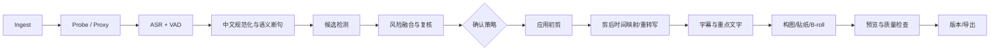

# 中文知识口播工作流

## 1. 目标与原则

输入一段或多段中文口播素材，输出可人工继续编辑的 Timeline 初剪、字幕、基础画面处理和质量报告。

优先级：

1. 不错删独有语义。
2. 不截断音节、呼吸尾音和自然语气。
3. 每个删除有 evidence、risk、reason、confidence。
4. 人工修订后可继续由 Agent 接管。
5. 自动模式也不越过锁、上传/付费和高风险删除策略。

## 2. 阶段图



## 3. 标准阶段

| 阶段 | 输入 | 输出 | 模型/算法 | 人工确认 | 失败处理 | 缓存 | 成本与回退 |
|---|---|---|---|---|---|---|---|
| 0. Preflight | 项目、素材、模式、provider policy | capability/privacy/cost plan | ffprobe、provider health | 网络/付费路径需确认 | 缺 FFmpeg/codec 时 doctor 指引；不改项目 | 环境版本短缓存 | 免费；无本地 ASR 可选云或暂停 |
| 1. Ingest | 本地 path | Asset、hash、stream metadata | SHA-256、ffprobe | 仅项目外路径授权 | 不支持素材标 offline/unsupported | content hash | 本地；复制空间不足可 reference |
| 2. Derivatives | Asset | proxy、audio extract、waveform、filmstrip | FFmpeg | 否 | 单 derivative 失败不阻断其余；原子临时文件 | asset hash + profile + FFmpeg build | 本地算力；codec 不兼容强制 proxy |
| 3. ASR/VAD | audio derivative、语言、词典 | Transcript words/segments、VAD、provider run | 默认 FunASR；候选云 ASR；WhisperX 回退 | 上传云端需确认 | 分块重试；保留原始响应；不产生 timeline | audio hash + provider/model/options | 调用前估价；本地慢可云，云失败可本地 |
| 4. 标点/规范化/断句 | Transcript、VAD、可选口播稿 | normalized transcript、sentence graph | 中文标点恢复、数字/中英规范化、静音+语义边界 | 专名低置信可提示校对 | 保留原始 token；失败降级到 VAD 断句 | transcript hash + rules version | 本地规则/LLM；无 LLM 仍可继续 |
| 5. 机械候选 | words、VAD、audio features | silence/filler/stutter candidates | interval、lexicon、重复字符串、能量/呼吸特征 | 否 | 某 detector 失败独立记录 | inputs + detector version | 本地低成本 |
| 6. 语义候选 | sentence graph、上下文、可选稿件 | false start/restatement/repetition/incomplete candidates | LLM/NLI + exact coverage checks | 否，仅生成候选 | JSON schema 失败重试一次；否则降级机械候选 | redacted input hash + model/prompt | 可本地/云；预算不足只跑高风险候选 |
| 7. 风险融合 | 所有 candidates、风格、用户偏好 | 三档决策、risk、alternatives | deterministic rules + calibrated scorer | 导演模式全部；自动模式 medium/high | 不确定统一降级 `suggest_keep` | candidate set + policy | 本地；不允许“模型说删就删” |
| 8. 对抗复核 | medium/high candidates | verified/rejected/needs_user | 独立 reviewer 或不同 prompt/model + coverage proof | `needs_user` 必须确认 | reviewer 不可用则全部需用户 | candidate/evidence/reviewer version | 只在高风险投入成本 |
| 9. Edit proposal | accepted candidates、source mapping | typed transaction proposal、预期时长 | interval algebra、ripple planner | 高风险/大批量确认 | dry-run 失败回到 candidate mapping | revision-bound，不跨 revision 复用 | 本地 |
| 10. Apply cut | proposal、base revision、approval | committed revision、inverse、diff | command bus | 已在 proposal 阶段 | 冲突则 diff/replan；事务失败零写入 | 不缓存 | 本地 |
| 11. 剪后映射/重转写 | 新 timeline、原 transcript | cut transcript、边界 QA、可选新 ASR | source-time map；必要时只重转写拼接边界/全片 | 专名可确认 | 新 ASR 失败沿用 mapped transcript 并标警告 | timeline hash + ASR config | 默认映射；发布前可选重转写提高字幕质量 |
| 12. Caption | confirmed transcript、StyleSpec | Caption clips + word timings | 语义分行、标点、关键词模型/规则 | 导演模式确认样式/专名 | 字体缺失回退并警告；不改 transcript | transcript + style + font hashes | 本地/LLM 可选 |
| 13. Visual treatment | timeline、face tracks、StyleSpec、素材策略 | transform/graphic/B-roll proposal | face tracking、scene rules、Agent planning | 外部/生成素材与高成本确认 | tracking 失败用固定 crop；素材不足保持干净口播 | asset/style/model hash | 默认用户素材；stock/AI 按 policy 估价 |
| 14. Preview/QC | revision、preset | preview、quality report | browser render、FFmpeg sample、silence/cut/overlap/font checks | 关键问题需用户决定 | 精确预览不支持则生成 proxy preview | revision + renderer build | 本地；只渲染变化窗口 |
| 15. Version/Export | 通过 QC 的 revision | named version、MP4/report | FFmpeg compiler | 最终 preset/覆盖文件确认 | 临时文件；失败不覆盖旧 export | version + preset 可复用中间段 | 硬编失败回退软编并更新估时 |

### 3.1 第一阶段审阅界面

- Transcript 是第一阶段的主编辑表面，播放器、文稿和底层 source range 双向同步；点击任意文字跳转并播放对应原片。
- `proposed_remove` 只做背景标记并显示原因类别，不提前伪装成已经删除。
- transaction 提交后，对应文字变为低对比度删除线，但仍留在原文位置；点击可试听原始范围、查看 Agent evidence 或作为新 transaction 恢复。
- 停顿、语气词、重复/重说分别显示数量并可筛选；批量应用前展示预计删除时长和风险分布。
- 低/中风险候选可在「批量审阅」模式逐项勾选后按**一次可恢复事务**成批删除（一个 revision、一次 undo，恢复时整批还原并在界面明示）；高风险候选永远不进入批量，必须逐项循环试听、勾选确认后单独提交。
- 高风险候选不能混入“一键删除全部”；锁定文字、数字、否定词、专名与低边界置信内容默认保留。
- 不同 detector 的候选若 source range 重叠，不能按队列顺序独立执行。审阅层先形成连通冲突组，以高风险语义/完整文字候选为主项；用户决定主项时同事务解决其余替代项，恢复也整组恢复。这样不能因为先删一个带呼吸余量的 gap 而让后续重复候选变成半个词或不可编辑范围。
- 删除线是状态表达而不是直接修改 DOM 文本。每段状态必须来自 revision-bound candidate/command，刷新和重启后可从 project store 重建。

## 4. 候选生成细节

### 4.1 低风险

- 足够长的纯非语音区间，但保留最小 pre/post roll。
- 被后文逐字覆盖的短卡顿前缀。
- 明确、短、无独有语义的填充词；仍检查与相邻词的声学粘连。

低风险不等于永远删除。若位于 Hook、强调停顿、用户锁、音乐节拍或呼吸自然度异常，提升风险。

### 4.2 中高风险

- 整句重说、残句、前后表达相似但尾部不同。
- 含数字、否定、比较、专名、结论、转折、因果词的片段。
- 删除后造成代词无指向、问题无回答、逻辑跳跃。
- 与 B-roll/重点文字/章节 marker 绑定的内容。

### 4.3 风险规则

```text
错删成本 > 漏删成本
exact coverage proof > semantic similarity
短前缀 < 长片段 < 整句/跨句
用户明确保留 > StyleSpec 节奏偏好 > 默认紧凑
```

自动模式策略草案：

- `definite_remove && low`：可自动应用。2026-08-11 起该集合只含高置信填充词（嗯/呃/额，confidence ≥0.85、时长 ≤800ms）；停顿无论长短一律 `suggest_remove`，不自动删（precision 可审计性修复，见开发记录同日条目）。
- medium：默认建议删除，不自动。
- high：默认建议保留，只有用户逐项批准才删。
- 任意 detector 分歧、时间边界低置信、锁冲突：提升风险。

## 5. 剪切边界

删除语义片段后，边界由声学层修正：

- 从词级时间戳取候选窗口，再用 VAD/能量/zero crossing 做有限范围吸附。
- 默认保留呼吸/辅音 attack/release 的 guard band；不把所有停顿压成 0。
- 交叉淡化只用于音频且很短；不能掩盖语义断裂。
- 视频 jump cut 可配轻微 punch-in，但不能每切必放大。
- 通过 cut-boundary audio samples 和字幕 word alignment 检查吞字。

## 6. 字幕

- Transcript word 是证据；Caption line 是展示。
- 中文分行优先语义块、标点、视觉长度，不按固定字符数硬切。
- 不把标点孤立到下一行，不拆数字/英文词/专名。
- 每屏默认 1–2 行；StyleSpec 可以改变但要受安全区和字号下限约束。
- 关键词高亮是 assertion；一句默认 0–2 个，避免整屏“每字都重要”。
- 用户手改 caption text/property 后自动建立 property lock 或显式选择是否允许 Agent 重排。

## 7. 横屏转竖屏

V0.1 分层回退：

1. face/person track 可靠：生成分段 crop keyframes，并限制速度/安全区。
2. track 不稳定：按 shot 选择静态 crop。
3. 无人脸/屏幕演示：使用主体/显著性或用户固定 crop。
4. 无可靠结果：letterbox/背景模糊填充并提示，不裁掉关键信息。

自动 crop 的 evidence 与 confidence 记录在 provenance；用户调整后锁定 transform。

## 8. StyleSpec 应用

顺序：

1. 先满足内容正确性和可读性硬约束。
2. 再采用用户明确选择的 style dimension。
3. `require` 规则仍不能越过 codec、字体、安全区和用户锁。
4. 每个 style-derived operation 写明 rule ID。
5. 参考素材中的具体文字、logo、贴纸或逐镜头内容不复制。

## 9. 成本记录

每个 run 记录：

- 本地处理时长、CPU/GPU、峰值内存。
- Provider、model、输入单位、输出单位、估计/实际费用。
- 上传数据类型与大小。
- cache hit、retry、outcome unknown。
- AI 生成素材逐项成本，不能只记整个工作流总价。

## 10. 质量检查

### 10.1 结构

- 所有引用存在，范围合法，无意外 overlap/gap。
- caption/word timing 单调并落在 sequence 内。
- 用户锁未被越过，proposal/approval hash 一致。

### 10.2 内容

- 删除后无断句、指代断裂、重复残留或结论丢失。
- 专名、数字、否定词、单位 spot-check。
- Hook 前 3–8 秒保持完整且与正文一致。

### 10.3 音视频

- cut 边界无爆音、吞字；音画同步。
- 字幕不越安全区、不遮关键脸部/画面信息。
- crop 不丢失说话人或屏幕关键区域。
- preview/export parity report 无 silent degradation。

## 11. Benchmark

至少构建以下分层：普通话/口音、中英混说、专名数字、快语速、长停顿、重说、情绪强调、背景音乐、录屏+人像、VFR 手机素材。

指标：

- ASR CER、word boundary MAE/P90。
- 候选级 precision/recall，按 risk/reason 分桶。
- `definite_remove` precision 与高风险错删数。
- 边界吞字率、人工恢复次数。
- 人工从初剪到接受版本的分钟数。
- 用户对节奏/自然度/信息完整度盲评。

## 12. 降级承诺

即使 LLM、云 Provider、人脸跟踪或动态视觉不可用，系统仍必须完成：导入、基础转写（若有任一 ASR）、人工 Transcript 编辑、基础时间线、字幕、预览、版本、FFmpeg 导出。增强能力失败不能破坏基础编辑项目。
